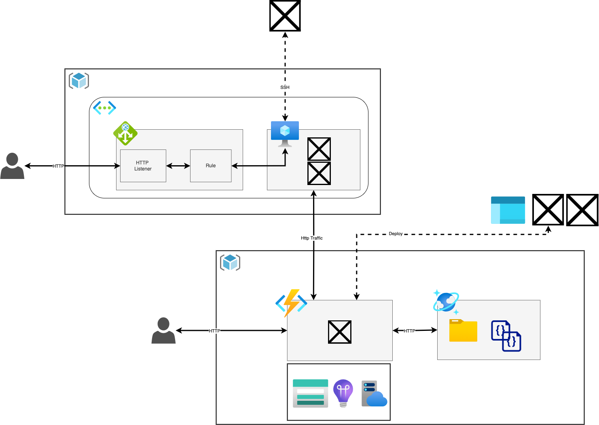

# AzureFundamentalsDay

This repository contains some basic demo's for showcasing the capabilities of Azure.

## What we will be building today.
I hope you are excited about software engineering. Today, we'll be leveraging Azure to build an application. We'll be covering the building blocks that make up every application: Infrastructure, Compute, Storage and Networking. However, we won't simply do it once. Azure provides a wide range of services (200+ at the time of speaking) and we will touch some of them. In particular, we are going to be looking at some of the services which are relatively low in the stack (i.e. Infrastructure as a Service, IaaS) and high in the stack (Platform as a Service, PaaS). We'll see the difference between IaaS, which enables a high degree of control, and serverless, which provides some abstractions and enables rapid development.


### Resource Groups, VNet, Application Gateway, Virtual Machine
Our first application will deploy the Apache WebServer to a VM running Ubuntu 20.04. An Application Gateway instance will proxy incoming requests to the VM. 

The first 


## Azure VM with Application Gateway + VNET

Archicture:

Create Ubuntu 20.04 vm in the portal (create Application Gateway during that process as well)
navigate to

```
chmod 400 </insert/path/to/key/>
ssh -i path/to/pemfile.pem azureuser@ipadress

sudo apt-get update
sudo apt-get install apache2

curl http://localhost:80

cd /var/www/html
sudo vim index.html --> change "It works" --> "Default page modified by team X"

sudo apt remove apache2


```

## Show budgets, alerting, cost analysis

## Azure Functions deploy from portal and deploy using VSCode extensions

## Generate traffic and showcase application insights' live metrics

```
ssh -i path/to/pemfile.pem azureuser@ipadress
sudo apt-get install apache2-utils

ab -n 1000 -c 100 <insert function endpoint>

ab -n 10000 -c 100 <insert function endpoint>
```
