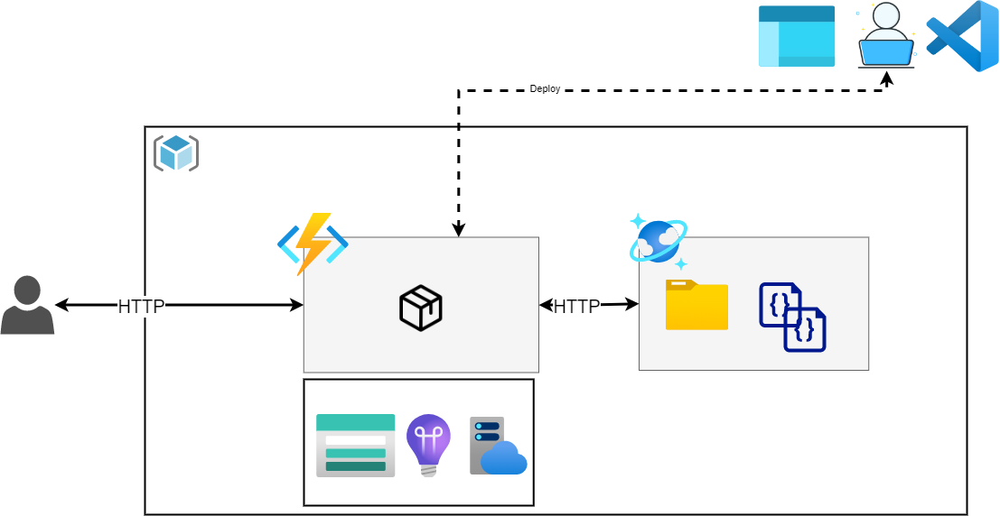
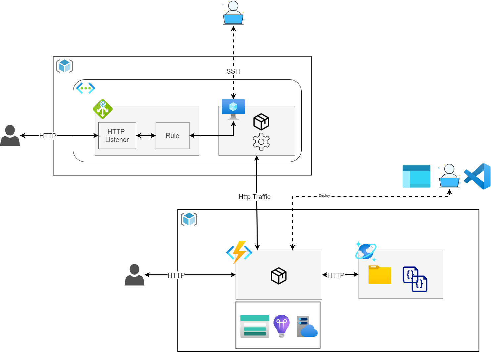

# AzureFundamentalsDay

This repository contains some basic demo's for showcasing the capabilities of Azure.

## What we will be building today.
I hope you are excited about software engineering. Today, we'll be leveraging Azure to build an application. We'll be covering the building blocks that make up every application: Infrastructure, Compute, Storage and Networking. However, we won't simply do it once. Azure provides a wide range of services (200+ at the time of speaking) and we will touch some of them. In particular, we are going to be looking at some of the services which are relatively low in the stack (i.e. Infrastructure as a Service, IaaS) and high in the stack (Platform as a Service, PaaS). We'll see the difference between IaaS, which enables a high degree of control, and serverless, which provides some abstractions and enables rapid development.


### Resource Groups, VNet, Application Gateway, Virtual Machine
Our first application will deploy the Apache WebServer to a VM running Ubuntu 20.04. An Application Gateway instance will proxy incoming requests to the VM. Let's go to the portal and walk throught the creation of this architecture.

Archicture:


While the services are spinning up, let's move forward with explaining some of the Azure Platform Platform capabilities.

## Show Azure Advisor, budgets, (cost) alerting
In this section, we'll take a brief look at some of the functionality of Azure that's there out of the box.
Azure Advisor gives recommendations on how to improve your workloads/applications.
Budgets can be helpful in cost management and combined with alerts provide proactive information if you are reaching a given limit.
Alerts can be based on cost (use cost alerts for that) or based on metrics (e.g. CPU usage).


### Commands to run
Great! you have deployed your vm, application gateway and vnet. Let's move forward and do the following:
- download the public/private key which will be used to ssh into the vm
- install the apache webserver on the vim
- access the VM endpoint using it's public IP
- access the Application Gateway's endpoint through it's public IP

```
#change rights on the key
chmod 400 </insert/path/to/key/>

#ssh into the vm
ssh -i path/to/pemfile.pem azureuser@ipadress

# update apt and install apache webserver
sudo apt-get update
sudo apt-get install apache2

# curl local endpoint to validate response
curl http://localhost:80

# modify default webpage
cd /var/www/html
sudo vim index.html --> change "It works" --> "Default page modified by team X"

```

## Azure Functions deploy from portal and deploy using VSCode extensions
Let's move on to creating an Azure Function. We'll be seeing how to do this from within the portal as from within VSCode leveraging some of the Azure Extensions.



We'll be completing the following steps:
- deploy function app from the portal
- deploy function app through vscode
- Inspect logs to troubleshoot 500 internal server error
- Fix the issue and upload an item to cosmos db


## Generate traffic and showcase application insights' live metrics
The goal here is to get a better understanding of how to analyze your application. We have already worked with Log Analytics (which is also part of Azure Monitor) and are now moving forward with Application Insights. Application Insights provides insights into your application (e.g. how many requests did my service handle, what exceptions where raised). We'll be exploring the live metrics section of application insights to inspect the load on your application in real time. Ready for it?!



Steps to complete:
- Active application insights live metrics feature
- ssh into the vm we already deployed
- use Apache Benchmark to generate traffic on the server
- See scaling functionality and requests coming in


```
ssh -i path/to/pemfile.pem azureuser@ipadress
sudo apt-get install apache2-utils

ab -n 1000 -c 100 <insert function endpoint>

ab -n 10000 -c 100 <insert function endpoint>
```
